# >vanish

A private, self-destructing chat room. Messages disappear. No logs. No history.


## Features

- **Private Rooms:** Create secure chat rooms with unique IDs
- **Self-Destructing:** Messages auto-delete when the room expires
- **Real-time:** Instant message delivery with Upstash Realtime
- **Anonymous:** Random usernames, no accounts needed
- **Room Destruction:** Manually destroy rooms and all messages instantly

## High-Level Flow

```mermaid
sequenceDiagram
    participant U1 as User A (Browser)
    participant U2 as User B (Browser)
    participant FE as Next.js Frontend
    participant MW as Middleware (Proxy)
    participant API as Elysia API
    participant RD as Upstash Redis
    participant RT as Upstash Realtime

    Note over U1,RT: Room Creation

    U1->>FE: Click "CREATE SECURE ROOM"
    FE->>API: POST /api/room/create
    API->>RD: HSET meta:{roomId} + EXPIRE (10 min TTL)
    RD-->>API: OK
    API-->>FE: { roomId }
    FE->>U1: Redirect to /room/{roomId}

    Note over U1,RT: Joining a Room

    U1->>MW: Navigate to /room/{roomId}
    MW->>RD: HGETALL meta:{roomId}
    RD-->>MW: Room metadata
    alt Room not found
        MW-->>U1: Redirect /?error=room-not-found
    else Room full (2 users)
        MW-->>U1: Redirect /?error=room-full
    else Room available
        MW->>RD: HSET connected:[...existing, newToken]
        MW-->>U1: Set x-auth-token cookie + allow access
    end

    U2->>MW: Open shared room link
    MW->>RD: Validate + add token
    MW-->>U2: Set x-auth-token cookie + allow access

    Note over U1,RT: Sending Messages

    U1->>API: POST /api/messages { sender, text }
    API->>RD: Verify room exists (EXISTS meta:{roomId})
    API->>RD: RPUSH messages:{roomId}
    API->>RT: Emit "chat.message" to channel
    RT-->>U1: Real-time update
    RT-->>U2: Real-time update

    Note over U1,RT: Room Destruction

    alt Manual Destroy
        U1->>API: DELETE /api/room?roomId=...
        API->>RT: Emit "chat.destroy"
        API->>RD: DEL roomId, meta:{roomId}, messages:{roomId}
        RT-->>U1: Redirect to /?destroyed=true
        RT-->>U2: Redirect to /?destroyed=true
    else Auto-Expiry (TTL)
        RD->>RD: Keys expire after 10 min TTL
        FE-->>U1: Countdown hits 0, redirect to lobby
        FE-->>U2: Countdown hits 0, redirect to lobby
    end
```



## Tech Stack

- **Framework:** Next.js 16 (App Router)
- **Runtime:** Bun
- **API:** Elysia.js
- **Database:** Upstash Redis
- **Real-time:** Upstash Realtime
- **Styling:** Tailwind CSS 4

## Getting Started

### Prerequisites

- [Bun](https://bun.sh/) installed
- [Upstash Redis](https://upstash.com/) account

### Installation

1. Clone the repository:

   ```bash
   git clone https://github.com/YOUR_USERNAME/real-time-private-chat.git
   cd real-time-private-chat
   ```

2. Install dependencies:

   ```bash
   bun install
   ```

3. Create a `.env` file:

   ```env
   UPSTASH_REDIS_REST_URL=your_upstash_redis_url
   UPSTASH_REDIS_REST_TOKEN=your_upstash_redis_token
   ```

4. Run the development server:

   ```bash
   bun dev
   ```

5. Open [http://localhost:3000](http://localhost:3000)

## License

MIT

---

<p align="center">
  <i>Messages self-destruct faster than your motivation on a Monday.</i>
</p>
